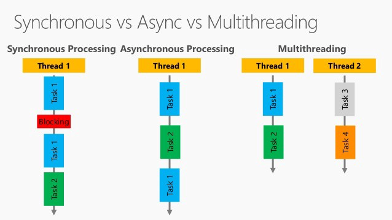

# Cheatsheets of Algorithms and Data Structures

Cheatsheets for Algorithms and Data Structures.

<!-- [:arrow_down: Tags legend](#tags-legend) at the end of the page. -->
<!-- -  by  ( _:movie_camera:_ ) -->

## Asynchronous vs Multithreading

<!-- ## Tags legend -->
<!-- - ( _:movie_camera:_ ) - video material -->
<!-- - ( _short_ ) - short overview -->
